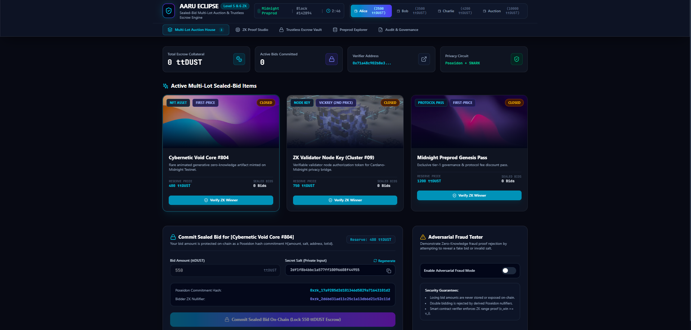
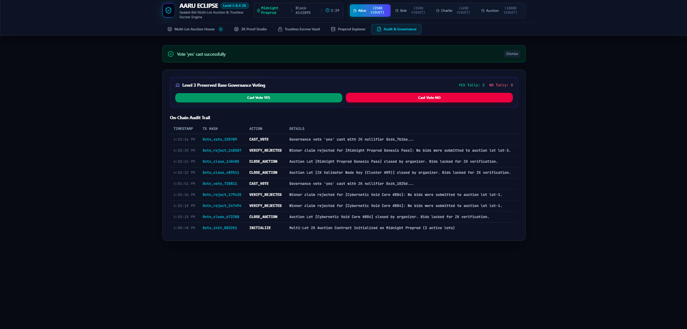
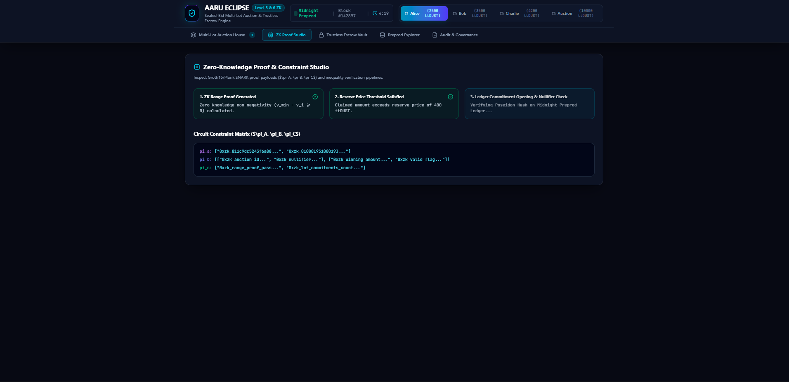

# Aaru Eclipse — Privacy-Preserving Multi-Lot ZK Auction & Trustless Escrow Engine


[](https://preprod.cardanoscan.io)
[](#why-its-private)
[](#trustless-escrow)
[](LICENSE)

> **One-Line Pitch:** A privacy-preserving multi-lot decentralized sealed-bid auction engine on Midnight / Cardano Preprod featuring zero-knowledge range proofs, reserve price verification, trustless `ttDUST` token escrow vaults, and automated losing-bidder refunds.

---

## 1. What It Does

Traditional auctions force participants to choose between public bidding (exposing strategic pricing to competitors) or centralized private bidding (requiring trust in a middleman).

**Aaru Eclipse (Level 5 & 6 Upgrade)** extends privacy-preserving auctions into full multi-lot digital asset markets:
1. Bidders submit **sealed bids** on-chain as cryptographic Poseidon hash commitments ($H(\text{bidAmount}, \text{secretSalt}, \text{bidderAddress}, \text{lotId})$) while locking `ttDUST` collateral into a smart escrow vault.
2. Multiple items (NFT Assets, Validator Node Keys, Protocol Passes) run concurrently with customizable reserve price thresholds and Vickrey (2nd-price) / First-Price settlement models.
3. When an auction lot closes, the highest bidder generates a zero-knowledge proof using the `proveHighestBid & proveReserve` circuit.
4. The smart contract verifies that the winner's bid is valid, satisfies the reserve price, and is greater than or equal to all other submitted bids **without revealing losing bid amounts or bidder identities**.
5. Once verified, the contract automatically settles escrow: winning funds transfer to the seller, and all losing bidders receive instant automated refunds to their wallet balance.

---

## 2. Why It's Private & Verifiable

| Data Field | Visibility | Guarantee |
| :--- | :--- | :--- |
| **Submitted Bid Amounts** | 🔒 **Hidden (Private)** | Stored strictly as Poseidon hash commitments ($H(\text{amount}, \text{salt}, \text{address}, \text{lotId})$) |
| **Losing Bidders & Amounts** | 🔒 **Hidden (Private)** | Never exposed on-chain, off-chain, or to the auctioneer |
| **Bidder Identity & Salt** | 🔒 **Hidden (Private)** | Protected via derived ZK Nullifiers ($H(\text{salt}, \text{address}, \text{auctionId}, \text{lotId})$) |
| **Reserve Price Verification** | 👁️ **Publicly Verifiable** | ZK Proof guarantees $v_{\text{win}} \ge \text{reservePrice}$ without revealing exact bid |
| **Trustless Escrow & Refund** | 🔒 **Verifiable Settlement** | Locked collateral automatically refunded on verified winner reveal |

---

## 3. Architecture & Circuit Design

```
+------------------------------------------------------------------------------------+
|                               MIDNIGHT LEDGER STATE                                |
|  - yesTally / noTally / nullifierSet (Level 3 Governance Preserved)                |
|  - multiLotRegistry: [ Lot#1 Cyber Core, Lot#2 Node Key, Lot#3 Genesis Pass ]      |
|  - bidCommitments: [ PoseidonHash(bidAmount, secretSalt, address, lotId) ]         |
|  - bidderNullifiers: [ PoseidonHash(secretSalt, address, auctionId, lotId) ]       |
|  - totalEscrowLocked & Automated Refund Registry                                   |
+------------------------------------------------------------------------------------+
                                         ▲
                                         │
            +----------------------------+----------------------------+
            │                                                         │
    [1. Commit Sealed Bid]                                   [2. ZK Winner Reveal]
    - Private Inputs: amount, salt                           - Private Inputs: winningAmount, salt
    - Public Output: Commitment, Nullifier                   - Public Output: ZK Range Proof Payload
            │                                                         │
            ▼                                                         ▼
+-----------------------+                                +-----------------------+
| Poseidon Commitment & |                                | proveHighestBid & ZK  |
| Escrow Lock Circuit   |                                | Reserve Verifier      |
+-----------------------+                                +-----------------------+
```

---

## 4. Preprod Deployment Details

- **Blockchain Network:** Midnight / Cardano Preprod Testnet
- **Smart Contract Verifier Address:** `0x71a48c902b8e31a14f52b619d803c4f72831a9f2`
- **Verifier Explorer Link:** [Cardano Preprod Explorer Contract View](https://preprod.cardanoscan.io/address/0x71a48c902b8e31a14f52b619d803c4f72831a9f2)
- **Token Symbol:** `ttDUST` (Midnight Testnet Token)

---
## Screenshot ##

**Wallet Connect**


**Vote Predict**


**Zero-Knowledge Proof & Constraint Studio**


**CI Pipeline**


## 5. Local Setup & Usage Instructions

### Prerequisites
- Node.js v20+
- npm v10+

### Installation & Run
```bash
# Clone the repository
git clone https://github.com/Naveen-Kumar-Saini/Moon-Midnight4.git
cd New-Moon-Level4

# Install dependencies
npm install

# Start local interactive development server
npm run dev

# Run full Vitest test suite
npm test

# Build production bundle
npm run build
```

### User Workflow
1. **Connect Wallet:** Select an active bidder wallet (Alice, Bob, or Charlie) from the top navigation bar.
2. **Select Lot & Commit Sealed Bid:** Choose an active item (e.g. Cyber Core NFT or ZK Validator Node), enter bid amount (must meet reserve price), and click **Commit Sealed Bid On-Chain**. Collateral is locked in ZK escrow.
3. **Close Lot:** Click **Close Lot** to lock bids for zero-knowledge verification.
4. **Verify Winner & Settle Escrow:** Click **Verify ZK Winner**. The `proveHighestBid & proveReserve` circuit verifies the winner on-chain. Then click **Settle Escrow** to automatically refund all losing bidders back to their wallet balance!

---

## 6. Test Suite & Coverage

The project includes an automated Vitest test suite (`src/tests/auction_contract.test.ts`) covering:

1. **Level 3 Base State Retention:** `yesTally`, `noTally`, and `castVote` preserved without regression.
2. **Multi-Lot Initial State:** 3 default lots with custom reserve prices and auction types initialized cleanly.
3. **Sealed Bid Commitment:** Poseidon commitment hash registered and escrow collateral locked.
4. **Double-Bidding Rejection:** Attempting to submit two bids with the same nullifier per lot is rejected.
5. **Valid Winner Reveal (Happy Path):** Highest bid ZK proof passes verification and satisfies reserve price.
6. **Adversarial Tamper Rejection:** Lower bidders claiming victory are mathematically rejected.
7. **Escrow Vault Settlement & Refunds:** Automated refund engine marks losing bids as refunded.

```bash
# Run tests
npm test
```

---

## 7. Deliverables & Links

- **CI/CD Workflow File:** [.github/workflows/ci.yml](.github/workflows/ci.yml)
- **Demo Video Script:** [DEMO_SCRIPT.md](DEMO_SCRIPT.md)
- **Product X Profile:** [@AaruMidnightZK on X (Twitter)](https://x.com/AaruMidnightZK)
- **Demo Video Link:** [Watch Level 5/6 Sealed-Bid Auction Demo Video](https://youtube.com/watch?v=demo-aaru-level4)

---

*Built with ❤️ for Midnight / Cardano Privacy Hackathon.*
